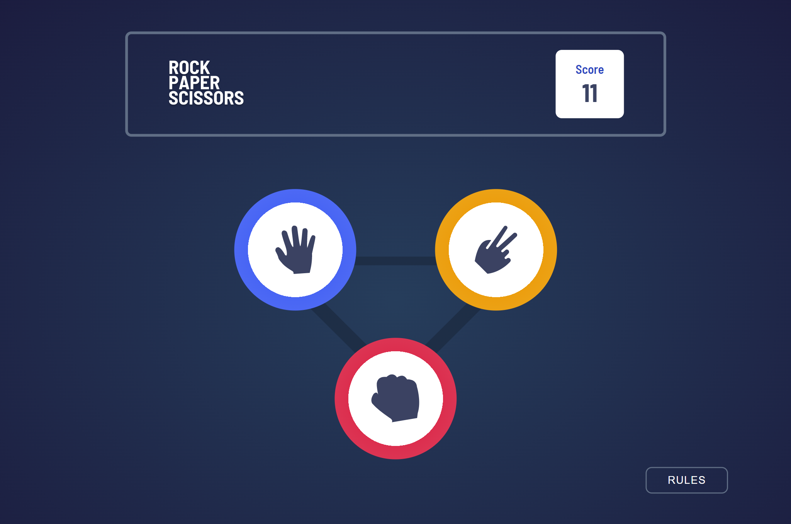

# Frontend Mentor - Rock, Paper, Scissors solution

This is a solution to the [Rock, Paper, Scissors challenge on Frontend Mentor](https://www.frontendmentor.io/challenges/rock-paper-scissors-game-pTgwgvgH). Frontend Mentor challenges help you improve your coding skills by building realistic projects.

## Table of contents

-   [Overview](#overview)
    -   [The challenge](#the-challenge)
    -   [Screenshot](#screenshot)
    -   [Links](#links)
-   [My process](#my-process)
    -   [Built with](#built-with)
    -   [What I learned](#what-i-learned)
    -   [Continued development](#continued-development)
-   [Author](#author)

## Overview

### The challenge

Users should be able to:

-   View the optimal layout for the game depending on their device's screen size
-   Play Rock, Paper, Scissors against the computer
-   Maintain the state of the score after refreshing the browser _(optional)_
-   **Bonus**: Play Rock, Paper, Scissors, Lizard, Spock against the computer _(optional)_

### Screenshot

### Links

-   Solution URL: https://github.com/ozzy1136/rock-paper-scissors/
-   Live Site URL: https://ozzy1136.github.io/rock-paper-scissors/

## My process

### Built with

-   Semantic HTML5 markup
-   CSS custom properties
-   CSS animations
-   Mobile-first workflow
-   [React](https://reactjs.org/) - JS library

### What I learned

<!-- TODO -->

### Continued development

I hope to have more projects that integrate CSS animations, because, although they are somewhat difficult to manage without an animation library, they can be great for user experience. I definitely have to seek out more resources and guides to better manage keyframes and I probably should pick up [GSAP](https://greensock.com/gsap/).

Aria attributes are another area that I need to continue to learn about. Especially on a project like this one, where there is a lot of updating content, it is important that low vision and blind users are able to get the information as it changes. I included an aria-live attribute on elements that have updating text content, but they don't seem to be announced every time. I wil continue to learn about this attribute and if there are any quirks when using aria attributes with React.

## Author

-   Website - [Ozmar Mendoza](https://ozzy1136.github.io)
-   Frontend Mentor - [@ozzy1136](https://www.frontendmentor.io/profile/ozzy1136)
-   Twitter - [@11_crack](https://www.twitter.com/11_crack)
